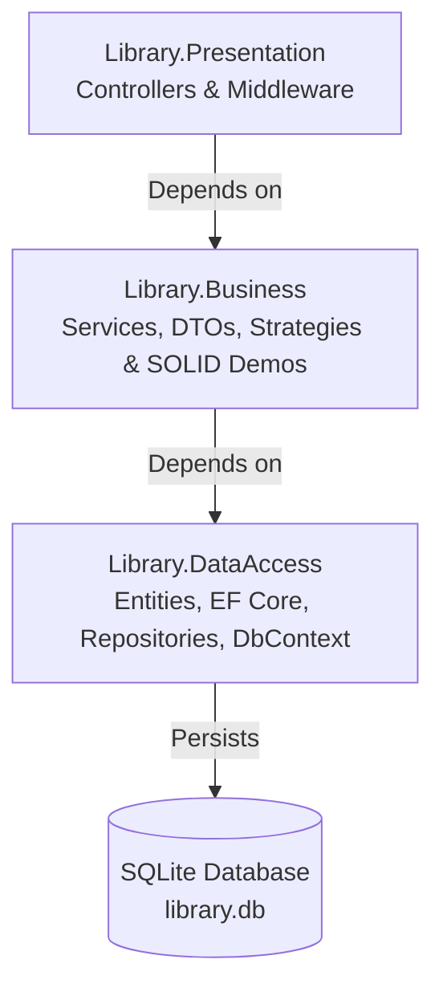

# 📚 WebLibrary - Quản Lý Thư Viện & Thực Hành SOLID Principles (.NET 10)

> Dự án Web API mẫu xây dựng trên nền tảng **.NET 10** theo mô hình **Kiến trúc 3 Lớp (3-Tier Layered Architecture)**, kết hợp việc hiện thực và đối chiếu chi tiết **5 nguyên lý thiết kế SOLID (Clean vs. Violation)** trong bài toán quản lý thư viện thực tế.

---

## 📑 Mục lục
- [Giới thiệu tổng quan](#-giới-thiệu-tổng-quan)
- [Kiến trúc hệ thống (3-Tier Architecture)](#-kiến-trúc-hệ-thống-3-tier-architecture)
- [Phân tích & Đối chiếu 5 nguyên lý SOLID](#-phân-tích--đối-chiếu-5-nguyên-lý-solid)
  - [1. Single Responsibility Principle (SRP)](#1-s---single-responsibility-principle-srp)
  - [2. Open/Closed Principle (OCP)](#2-o---openclosed-principle-ocp)
  - [3. Liskov Substitution Principle (LSP)](#3-l---liskov-substitution-principle-lsp)
  - [4. Interface Segregation Principle (ISP)](#4-i---interface-segregation-principle-isp)
  - [5. Dependency Inversion Principle (DIP)](#5-d---dependency-inversion-principle-dip)
- [Cấu trúc thư mục dự án](#-cấu-trúc-thư-mục-dự-án)
- [Công nghệ sử dụng](#-công-nghệ-sử-dụng)
- [Hướng dẫn cài đặt & Khởi chạy](#-hướng-dẫn-cài-đặt--khởi-chạy)
- [Danh mục API & Kịch bản kiểm thử](#-danh-mục-api--kịch-bản-kiểm-thử)

---

## 🌟 Giới thiệu tổng quan

**WebLibrary** là dự án quản lý hoạt động mượn/trả sách, tính toán biểu phí phạt trễ hạn theo đối tượng độc giả và loại sách. Dự án được thiết kế với mục tiêu kép:
1. Cung cấp một ứng dụng Backend Web API hoàn chỉnh, chuẩn mực, dễ bảo trì và mở rộng.
2. Cung cấp bộ so sánh trực quan song song (Side-by-Side) giữa **mã nguồn vi phạm (Bad/Violation)** và **mã nguồn chuẩn mực (Clean/Compliant)** cho cả 5 nguyên lý SOLID.

---

## 🏗 Kiến trúc hệ thống (3-Tier Architecture)

Hệ thống được chia thành 3 tầng độc lập với luồng phụ thuộc một chiều:



### Chi tiết các tầng:
* **`Library.Presentation`**: Tầng giao tiếp người dùng/client qua RESTful API, tiếp nhận Request, chuyển giao xử lý và trả về HTTP Response. Tích hợp Swagger UI và Middleware xử lý lỗi tập trung.
* **`Library.Business`**: Tầng nghiệp vụ cốt lõi, hiện thực quy tắc tính phí, quy trình mượn/trả, định nghĩa DTOs, áp dụng Strategy Pattern và các mô hình thiết kế SOLID.
* **`Library.DataAccess`**: Tầng thao tác dữ liệu, chứa Entities, `LibraryDbContext` (EF Core với SQLite), Repositories và cơ chế khởi tạo/seed dữ liệu tự động.

---

## 🧩 Phân tích & Đối chiếu 5 nguyên lý SOLID

| Nguyên lý | Phiên bản Vi phạm (Legacy / Violation) | Phiên bản Chuẩn mực (Clean / Compliant) |
| :--- | :--- | :--- |
| **S - Single Responsibility** | `BadBorrowManager` ôm đồm 5 trách nhiệm (tìm sách, tính phí, cập nhật DB, ghi log file, gửi mail). | `BorrowApplicationService` đóng vai trò điều phối, tách riêng Repository, Fee Service và Notification. |
| **O - Open/Closed** | `LegacyFeeCalculator` dùng chuỗi `if-else`/`switch-case` khổng lồ, sửa đổi logic cũ khi thêm loại sách mới. | `ILateFeeStrategy` kết hợp Strategy Pattern đa hình, thêm luật tính phí mới chỉ cần tạo thêm class. |
| **L - Liskov Substitution** | `BadReferenceOnlyBook` kế thừa class mượn nhưng ném Exception khi mượn, làm sập cả chu trình duyệt đa hình. | Tách hợp đồng thành `IBorrowableResource` và `IInLibraryConsultableResource`. |
| **I - Interface Segregation** | `IFatLibraryOperations` (Fat Interface) ép Guest Kiosk phải implement cả các hàm quản trị thừa. | Chia nhỏ thành các Role-based Interfaces: `IBookSearchService`, `IBookBorrowingService`, `IBookInventoryService`,... |
| **D - Dependency Inversion** | `BadBorrowNotificationManager` tự khởi tạo (`new`) trực tiếp các lớp hạ tầng cứng (SMS, SMTP, File). | `BorrowNotificationApplicationService` phụ thuộc vào Abstraction `INotificationSender` & `IAuditLogger`, hỗ trợ đa kênh qua DI. |

---

### 1. S - Single Responsibility Principle (SRP)
> *"Một lớp chỉ nên có một và chỉ một lý do để thay đổi."*

* **Vi phạm (`BadBorrowManager.cs`)**:
  Một class duy nhất vừa truy vấn Entity Framework, vừa tính toán tiền phạt, vừa cập nhật trạng thái sách, vừa mở File Stream ghi log, vừa giả lập gửi email thông báo.
* **Chuẩn mực (`BorrowApplicationService.cs`)**:
  - `IBorrowRecordRepository` / `IBookRepository`: Chịu trách nhiệm lưu trữ và truy vấn dữ liệu.
  - `ILateFeeApplicationService`: Chịu trách nhiệm tính toán biểu phí.
  - `BorrowApplicationService`: Chỉ làm nhiệm vụ điều phối luồng nghiệp vụ mượn/trả.

---

### 2. O - Open/Closed Principle (OCP)
> *"Phần mềm nên mở cho việc mở rộng (Open for extension), nhưng đóng với việc chỉnh sửa (Closed for modification)."*

* **Vi phạm (`LegacyFeeCalculator.cs`)**:
  Sử dụng nhiều tầng `switch-case` lồng nhau kiểm tra `BookType` và `MemberType`. Mỗi khi thư viện bổ sung loại sách mới hoặc đối tượng độc giả mới, lập trình viên buộc phải sửa mã nguồn hiện có, tiềm ẩn rủi ro phá vỡ logic cũ.
* **Chuẩn mực (`Library.Business/Strategies/`)**:
  Áp dụng **Strategy Pattern** qua interface `ILateFeeStrategy`. Khi cần thêm chính sách phí mới (VD: Sinh viên mượn giáo trình, Độc giả VIP, Sách hiếm, Báo/Tạp chí), chỉ cần tạo class mới hiện thực `ILateFeeStrategy` và đăng ký vào DI:
  - `StaffExemptionFeeStrategy` (Miễn phí cho nhân viên)
  - `VIPMemberFeeStrategy` (Giảm giá 50% cho VIP)
  - `StudentTextbookFeeStrategy` (Giảm giá 60% cho sinh viên mượn giáo trình)
  - `RareBookFeeStrategy`, `ForeignBookFeeStrategy`, `MagazineFeeStrategy`, `RegularBookFeeStrategy`,...

---

### 3. L - Liskov Substitution Principle (LSP)
> *"Các đối tượng của lớp con phải có khả năng thay thế cho các đối tượng của lớp cha mà không làm thay đổi tính đúng đắn của chương trình."*

* **Vi phạm (`LspViolationDemo.cs`)**:
  `BadReferenceOnlyBook` (Sách tham khảo chỉ đọc tại chỗ) kế thừa từ `BadLibraryResource`. Tuy nhiên, khi gọi phương thức `Borrow()`, class này ném ngoại lệ `InvalidOperationException`. Khi hệ thống duyệt danh sách đa hình các tài nguyên thư viện để xử lý mượn hàng loạt, ngoại lệ bị bắn ra làm sập toàn bộ chu trình.
* **Chuẩn mực (`LspCleanDemo.cs`)**:
  Tách biệt hợp đồng rõ ràng:
  - `IBorrowableResource`: Dành cho các tài nguyên được phép mượn về nhà (`PhysicalBorrowableBook`, `AudioBookPlayerDevice`).
  - `IInLibraryConsultableResource`: Dành cho tài liệu chỉ xem tại chỗ (`SpecialArchiveManuscript`).
  Xử lý đa hình trên `IBorrowableResource` đảm bảo an toàn tuyệt đối 100%.

---

### 4. I - Interface Segregation Principle (ISP)
> *"Client không nên bị ép buộc phải phụ thuộc vào những interface/phương thức mà nó không sử dụng."*

* **Vi phạm (`IspViolationDemo.cs`)**:
  `IFatLibraryOperations` định nghĩa 8 phương thức khác nhau (Tìm kiếm, Mượn, Trả, Thêm sách, In mã vạch, Xuất báo cáo...). Khi xây dựng ứng dụng Kiosk tra cứu công cộng (`BadGuestKioskClient`), client này chỉ cần tính năng tìm kiếm nhưng vẫn phải implement các phương thức quản trị và ném `NotImplementedException`.
* **Chuẩn mực (`IspCleanServices.cs`)**:
  Chia nhỏ thành các interface chuyên biệt theo vai trò (Role-based Interfaces):
  - `IBookSearchService`: Dành cho Kiosk tra cứu của khách.
  - `IBookBorrowingService`: Dành cho Trạm tự mượn trả (Self-Checkout Station).
  - `IBookInventoryService`, `IBarcodePrintingService`: Dành cho Thủ thư/Quản trị viên.

---

### 5. D - Dependency Inversion Principle (DIP)
> *"1. Các module cấp cao không nên phụ thuộc vào các module cấp thấp. Cả hai nên phụ thuộc vào Abstractions (Interfaces).  
> 2. Abstractions không nên phụ thuộc vào chi tiết. Chi tiết nên phụ thuộc vào Abstractions."*

* **Vi phạm (`DipViolationDemo.cs`)**:
  `BadBorrowNotificationManager` tự khởi tạo các class cụ thể (`new HardcodedSmsGateway()`, `new HardcodedSmtpMailer()`, `new HardcodedFileLogger()`). Dẫn đến việc phụ thuộc chặt vào hạ tầng (tightly coupled), không thể viết Unit Test và không thể thay đổi nhà cung cấp dịch vụ viễn thông/email linh hoạt.
* **Chuẩn mực (`DipCleanServices.cs`)**:
  `BorrowNotificationApplicationService` phụ thuộc hoàn toàn vào các abstraction:
  - `IEnumerable<INotificationSender>` (Hiện thực qua `EmailNotificationSender`, `SmsNotificationSender`, `ZaloNotificationSender`).
  - `IAuditLogger` (Hiện thực qua `InMemoryAuditLogger`).
  Tất cả các dịch vụ được nạp linh hoạt thông qua .NET Dependency Injection container.

---

## 📁 Cấu trúc thư mục dự án

```text
WebLibrary/
├── WebLibrary.slnx                       # Solution file
├── Library.DataAccess/                   # TẦNG DATA ACCESS (DAL)
│   ├── Entities/                         # Các thực thể cơ sở dữ liệu
│   │   ├── Book.cs                       # Thông tin sách
│   │   └── BorrowRecord.cs               # Thông tin phiếu mượn/trả
│   ├── Enums/                            # Các kiểu liệt kê (BookType, MemberType)
│   ├── Interfaces/                       # Interfaces của Repositories & Database Initializer
│   ├── Persistence/                      # DbContext, Migrations & Data Seed
│   │   ├── LibraryDbContext.cs           # Entity Framework DbContext
│   │   ├── DatabaseInitializer.cs        # Khởi tạo DB tự động
│   │   └── Repositories/                 # Hiện thực BookRepository & BorrowRecordRepository
│   └── DependencyInjection.cs            # Đăng ký Service cho tầng DataAccess
│
├── Library.Business/                     # TẦNG BUSINESS LOGIC (BLL)
│   ├── DTOs/                             # Data Transfer Objects (BookDto, BorrowDtos)
│   ├── Interfaces/                       # Application Service Interfaces
│   ├── Models/                           # FeeCalculationContext, FeeCalculationResult
│   ├── Services/                         # Application Services chuẩn SRP
│   ├── Strategies/                       # Chiến lược tính phí chuẩn OCP (Strategy Pattern)
│   ├── Lsp/                              # Minh họa thiết kế chuẩn Liskov Substitution
│   ├── Isp/                              # Minh họa thiết kế chuẩn Interface Segregation
│   ├── Dip/                              # Minh họa thiết kế chuẩn Dependency Inversion
│   ├── Legacy/                           # Các lớp minh họa VI PHẠM nguyên lý SOLID
│   │   ├── BadBorrowManager.cs           # Vi phạm SRP
│   │   ├── LegacyFeeCalculator.cs        # Vi phạm OCP
│   │   ├── LspViolationDemo.cs           # Vi phạm LSP
│   │   ├── IspViolationDemo.cs           # Vi phạm ISP
│   │   └── DipViolationDemo.cs           # Vi phạm DIP
│   └── DependencyInjection.cs            # Đăng ký Service cho tầng Business & DI chain
│
└── Library.Presentation/                 # TẦNG PRESENTATION (API)
    ├── Controllers/                      # REST API Controllers
    │   ├── BooksController.cs            # API Sách & Preview phí phạt (OCP vs Legacy)
    │   ├── BorrowController.cs           # API Mượn/Trả sách (SRP vs Legacy)
    │   └── SolidDemoController.cs        # API Demo kiểm thử trực quan LSP, ISP, DIP
    ├── Middleware/                       # ExceptionHandlingMiddleware
    ├── Program.cs                        # Điểm khởi chạy ứng dụng & Cấu hình Pipeline
    ├── Library.API.http                  # File kịch bản gọi thử toàn bộ API qua VS / Rider
    ├── appsettings.json                  # Cấu hình ứng dụng
    └── library.db                        # SQLite Database file (tự sinh)
```

---

## 💻 Công nghệ sử dụng

* **Ngôn ngữ & Runtime**: C# 13, .NET 10 (Target Framework: `net10.0`)
* **Framework Web**: ASP.NET Core Web API
* **ORM & Database**: Entity Framework Core 10.0 với SQLite (`Microsoft.EntityFrameworkCore.Sqlite`)
* **Tài liệu API**: OpenAPI / Swagger UI (`Swashbuckle.AspNetCore`)
* **Design Patterns & Kiến trúc**:
  * 3-Tier Layered Architecture
  * SOLID Principles (S-O-L-I-D)
  * Strategy Pattern
  * Repository Pattern
  * Dependency Injection & Inversion of Control (IoC)

---

## 🚀 Hướng dẫn cài đặt & Khởi chạy

### 1. Yêu cầu môi trường
* Cài đặt [.NET 10 SDK](https://dotnet.microsoft.com/download/dotnet/10.0).
* Visual Studio 2022 / 2025, Rider hoặc Visual Studio Code kèm C# Dev Kit.

### 2. Khởi chạy dự án

1. **Clone repository về máy local:**
   ```bash
   git clone <URL_REPOSITORY>
   cd WebLibrary
   ```

2. **Restore và Build mã nguồn:**
   ```bash
   dotnet restore
   dotnet build
   ```

3. **Chạy ứng dụng:**
   ```bash
   dotnet run --project Library.Presentation
   ```

4. **Truy cập Swagger UI:**
   Mở trình duyệt và truy cập vào đường dẫn:
   ```text
   http://localhost:5113/swagger
   # hoặc https://localhost:7113/swagger
   ```

> 💡 **Tự động Seed dữ liệu:** Khi ứng dụng khởi động lần đầu, hệ thống sẽ tự động tạo file cơ sở dữ liệu `library.db` và nạp sẵn 10 đầu sách mẫu cùng 3 phiếu mượn thực tế.

---

## 📡 Danh mục API & Kịch bản kiểm thử

Bạn có thể sử dụng giao diện **Swagger UI** hoặc trực tiếp mở file [`Library.Presentation/Library.API.http`](file:///c:/Users/dotru/source/repos/WebLibrary/Library.Presentation/Library.API.http) trong IDE để gửi request nhanh.

### 1. Quản lý Sách & Tính phí (OCP Demo)
| HTTP Method | Route | Mô tả | Nguyên lý |
| :--- | :--- | :--- | :--- |
| `GET` | `/api/books` | Lấy danh sách tất cả các đầu sách kèm trạng thái | Core Feature |
| `GET` | `/api/books/{id}` | Lấy chi tiết sách theo Id | Core Feature |
| `GET` | `/api/books/{id}/fee-preview?daysLate=5&memberType=3` | Xem trước phí phạt trễ hạn (**Chuẩn OCP** qua Strategy Pattern) | **OCP Clean** |
| `GET` | `/api/books/{id}/legacy-fee-preview?daysLate=5&memberType=3` | Xem trước phí phạt (**Vi phạm OCP** qua switch-case đồ sộ) | **OCP Violation** |

### 2. Quản lý Mượn / Trả Sách (SRP Demo)
| HTTP Method | Route | Mô tả | Nguyên lý |
| :--- | :--- | :--- | :--- |
| `GET` | `/api/borrow` | Lấy toàn bộ lịch sử danh sách mượn / trả | Core Feature |
| `POST` | `/api/borrow` | Tạo mới phiếu mượn sách | Core Feature |
| `POST` | `/api/borrow/{id}/return` | Trả sách (**Chuẩn SRP** - Tách riêng Repository, Service, Strategy) | **SRP Clean** |
| `POST` | `/api/borrow/{id}/return-srp-violation` | Trả sách (**Vi phạm SRP** - `BadBorrowManager` ôm đồm 5 trách nhiệm) | **SRP Violation** |

### 3. Demo Trực quan LSP, ISP, DIP (`SolidDemoController`)
| HTTP Method | Route | Mô tả | Nguyên lý |
| :--- | :--- | :--- | :--- |
| `GET` | `/api/soliddemo/lsp/violation-demo` | Mô phỏng sập chu trình khi đối tượng con ném ngoại lệ | **LSP Violation** |
| `GET` | `/api/soliddemo/lsp/clean-demo` | Xử lý đa hình an toàn với các tài nguyên hợp lệ | **LSP Clean** |
| `GET` | `/api/soliddemo/isp/violation-demo` | Minh chứng Kiosk bị ép implement hàm quản trị thừa | **ISP Violation** |
| `GET` | `/api/soliddemo/isp/clean-demo` | Hoạt động thông suốt qua các Role-based Interfaces | **ISP Clean** |
| `GET` | `/api/soliddemo/dip/violation-demo` | Nghiệp vụ bị gắn chặt với các class hạ tầng SMS/SMTP | **DIP Violation** |
| `POST` | `/api/soliddemo/dip/clean-notify` | Điều phối thông báo đa kênh qua Abstractions & DI | **DIP Clean** |

---

## 📝 License
Dự án được phân phối dưới giấy phép [MIT License](LICENSE).
